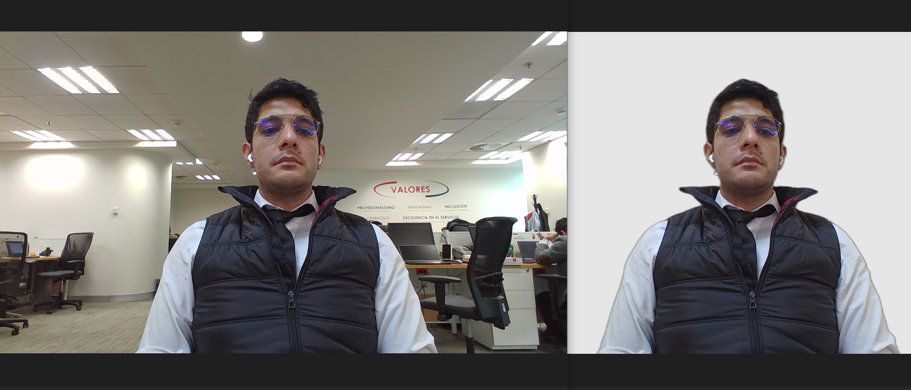

#   Remove Background
The main purpose of this project remove background from photos

Libraries used on project
------------------------------------
* import rembg
* import numpy as np
* from PIL import Image
* import os.path


APIS used on project
------------------------------------
* [Remove_bg  OWN_API](http://localhost:8888/remove_bg/index.php)

Components used on project
------------------------------------
* PYTHON 
* PHP
 
# Demo


Documentation
--------------------------
This proyect can be lauched by python command 

```
python C:\xampp\htdocs\remove_bg\view.py

```

or by API

Request
``` 

{
	"imagen":"B64"
}

```
Response ok
```

{
   "StatusCode": 200,
   "StatusMessage": "La imagen se proceso con exito.",
   "Response": "B64"
}

```
Response no ok
```

{
   "StatusCode": 400,
   "StatusMessage": "No se ha podido procesar la imagen.",
   "Response": null
}

``` 

Developed By
------------

* Jonathan Castillo Hurtado  - <developer.jonathanc@gmail.com>    


Version
------------------------------------

1.0.0

| Number  | Description |
| ------  | ------ |
|    1    | Refers to the number of issues with the 'refactor' tag. |
|    0    | Refers to the number of issues with the 'Affect flow', 'Crash' adn 'Critical' tag. |
|    0    | Refers to the number of issues with the 'Minior' tag.  |

